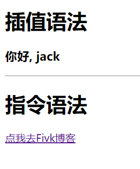
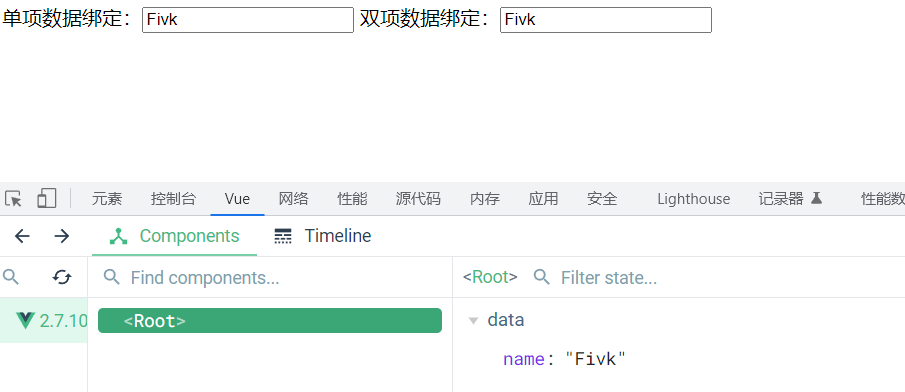
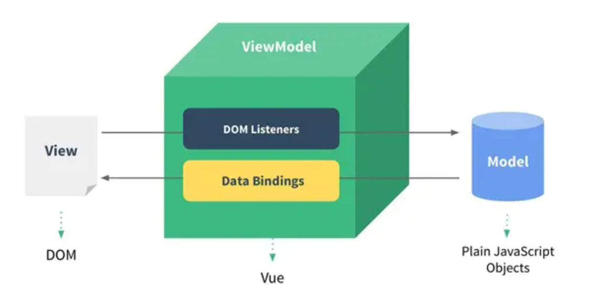
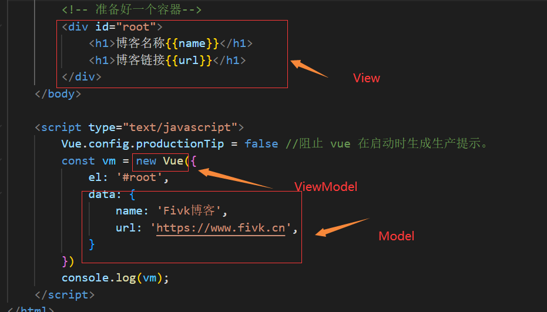

# 1.初始Vue

1. 想让Vue工作，就必须创建一个Vue实例，且要传入一个配置对象；
2. root容器里的代码依然符合Html规范，只不过混入了一些特殊的Vue语法；
3. root容器里面的代码成为【Vue模板】。
4. Vue实例和容器是一一对应的；
5. 真实开发中只有一个Vue实例，并且会配合着组件一起使用；
6. {{xxx}}中的xxx要写js表达式，且xxx可以自动读取到data中的所有属性；
7. 一旦data中的数据发生变化，那么页面中用到该数据的地方就会自动更新

### 注意区分 js表达式 和 js代码（语句）

- 表达式：一个表达式会产生一个值，可以放在任何一个需要的值的地方；
  1. `a`
  2. `a+b`
  3. `demo(1)`
  4. `x === y ? 'a' : 'b'`

- js代码（语句）
  1. `if(){}`
  2. `for(){}`

```html
<!DOCTYPE html>
<html lang="cn">
<head>
    <meta charset="UTF-8">
    <meta http-equiv="X-UA-Compatible" content="IE=edge">
    <meta name="viewport" content="width=device-width, initial-scale=1.0">
    <title>初始Vue</title>
    <!-- 引入Vue -->
    <script type="text/javascript" src="../js/vue.js"></script>
</head>
<body>

    <!-- 准备好一个容器 -->
    <div id="demo">
        <h1>hello, {{name.toUpperCase()}}, {{address}}</h1>
    </div>

    <script>
        Vue.config.productionTip = false    // 设置为 false 以阻止 vue 在启动时生成生产提示。
        
        // 创建Vue实例
        const x = new Vue({
            el: '#demo',    // el用于指定当前Vue实例为那个容器服务，值通常为css选择器字符串
            data:{  // data中用于存储数据，数据提供el所指定的容器去使用，值我们暂时携程一个对象。
                name: "Vue",
                address: "贵州"
            }
        })
    </script>

</body>
</html>
```

# 2.模板语法

Vue模板语法有2大类：

1. 插值语法：
   - 功能：用于解析标签体内容。
   - 写法：`{{xxx}}`，xxx是js表达式，且可以直接读取到data中的所有属性。


2. 指令语法：
   - 功能：用于解析标签（包括：标签属性、标签体内容、绑定事件.....）。
   - 举例：`v-bind:href="xxx"` 或简写为`:href="xxx"`，xxx同样要写js表达式，且可以直接读取到data中的所有属性。
   - 备注：Vue中有很多的指令，且形式都是：`v-????`，此处我们只是拿`v-bind`举个例子。

```html
<!DOCTYPE html>
<html lang="en">
<head>
    <meta charset="UTF-8">
    <meta http-equiv="X-UA-Compatible" content="IE=edge">
    <meta name="viewport" content="width=device-width, initial-scale=1.0">
    <title>模板语法</title>
    <script type="text/javascript" src="../js/vue.js"></script>
</head>
<body>

    <!-- 准备好一个容器 -->
    <div id="root">
        <h1>插值语法</h1>
        <h3>你好, {{name}}</h3>
        <hr>
        <h1>指令语法</h1>
        <a v-bind:href="info.url">点我去{{info.name}}</a>
    </div>
</body>

<script type="text/javascript">

    Vue.config.productionTip = false    // 阻止Vue启动时生成生产提示。

    new Vue({
        el:'#root',
        data:{
            name:'jack',
            info: {
                name: 'Fivk博客',
                url: 'https://blog.fivk.cn/'
            }
        }
    })
</script>
</html>
```



# 3.数据绑定

Vue中有2种数据绑定的方式：

1. 单向绑定（`v-bind`）：数据只能从data流向页面。
2. 双向绑定（`v-model`）：数据不仅能从data流向页面，还可以从页面流向data。

备注：
- 双向绑定一般都应用在表单类元素上（如：`input`、`select`等）。
- `v-model:value` 可以简写为 `v-model`，因为`v-model`默认收集的就是`value`值。

```html
<!DOCTYPE html>
<html lang="en">
<head>
    <meta charset="UTF-8">
    <meta http-equiv="X-UA-Compatible" content="IE=edge">
    <meta name="viewport" content="width=device-width, initial-scale=1.0">
    <title>数据绑定</title>
    <!-- 引入 Vue -->
    <script type="text/javascript" src="../js/vue.js"></script>
</head>
<body>

    <!-- 准备好一个容器 -->
    <div id="root">
        <!-- 普通写法 -->
        <!-- 单项数据绑定：<input type="text" v-bind:value="name">
        双项数据绑定：<input type="text" v-model:value="name"> -->

        <!-- 简写 -->
        单项数据绑定：<input type="text" :value="name">
        双项数据绑定：<input type="text" v-model="name">

        <!-- 以下代码是错误的，因为v-model只能应用再表单类元素上（输入类元素） -->
        <!-- <h2 v-model:x="name">你好呀</h2> -->
    </div>

    
</body>

<script text="text/javascript">
    Vue.config.productionTip = false;   // 阻止 vue 启动时生成生产提示。
    new Vue({
        el: '#root',
        data: {
            name: 'Fivk' 
        }
    })
</script>

</html>
```



# 4.el与data的两种写法

data与el的2种写法

1. el有2种写法
   - (1). `new Vue`时候配置`el`属性。
   - (2). 先创建Vue实例，随后再通过`vm.$mount('#root')`指定`el`的值。

2. data有2种写法
   - (1). 对象式
   - (2). 函数式
   
   如何选择：目前哪种写法都可以，以后学习到组件时，`data`必须使用函数式，否则会报错。

3. 一个重要的原则：
   - 由Vue管理的函数，一定不要写箭头函数，一旦写了箭头函数，`this`就不再是Vue实例了。

```html
<!DOCTYPE html>
<html>
	<head>
		<meta charset="UTF-8" />
		<title>el与data的两种写法</title>
		<!-- 引入Vue -->
		<script type="text/javascript" src="../js/vue.js"></script>
	</head>
	<body>
        
		<!-- 准备好一个容器-->
		<div id="root">
			<h1>你好，{{name}}</h1>
		</div>
	</body>

	<script type="text/javascript">
		Vue.config.productionTip = false //阻止 vue 在启动时生成生产提示。

		// el的两种写法
		// const v = new Vue({
		// 	// el: '#root',	// 第一种写法
		// 	data: {
		// 		name: '张三'
		// 	}
		// })

		// console.log(v);
		// v.$mount('#root')	// 第二种写法

		// data的两种写法
		new Vue({
			el: '#root',
			// data的第一种写法（对象式）
			// data: {
			// 	name: '张三'
			// }

			// data的第二种写法（函数式）

			// data: function() {
			data() {
				console.log("当前的", this);	// this指向的是Vue实例
				return {
					name: '张三'
				}
			}
		})
	</script>
</html>
```

# 4.MVVM模型

## 一、MVVM模型



MVVM模型

1. M：模型(Model) ：`data`中的数据
2. V：视图(View) ：模板代码
3. VM：视图模型(ViewModel)：Vue实例

观察发现：

1. `data`中所有的属性，最后都出现在了`vm`身上。
2. `vm`身上所有的属性 及 Vue原型上所有属性，在Vue模板中都可以直接使用。

具体到编码层面，**注意我们提到的MVVM都是前端的概念**，体现如下：



- VIewModel（VUE的实例）作为MVVM模型的核心，负责监听DOM的变化去修改Model（data）数据；负责将数据绑定到页面上进行数据展示及页面渲染。是View与Model沟通的桥梁。
- ViewModel帮我们实现了双向数据绑定的底层支撑，即VUE帮我们实现。
- ViewModel是对视图及模型的抽象，即可以操作视图，也可以操作数据模型，并实现二者的自动响应式的彼此影响。

## 二、MVVM模型与直接操作DOM的区别

如果，我们使用js操作DOM的方式完成上面的代码完成的工作。首先，我们需要先选取需要进行操作的DOM节点，为此我们需要为h2标签加上一个id，如h2id。然后通过ajax向服务器发送请求，接收服务端的数据。通过dom节点，操作节点的数据和显示样式。

```
var dom = document.getElementById('h2id');

//向服务器发送ajax请求，获取数据，如 '你好，Vue';

dom.innerText = '你好，Vue';
```

然而MVVM编程模型**不需要关心DOM的结构**。同样的操作只需要下面这一行代码：

```
app.message = '你好';
```

- MVVM模型不关心DOM的结构，不需要寻找DOM节点
- MVVM模型通过修改模型数据改变视图显示，不使用DOM的innerText、innerHtml等
- MVVM模型要求我们在前端考虑数据模型，这样有更利于前后端解耦，实现前后端分离应用的开发。（也就是说，开发阶段可以先在前端模型里面写假数据，前后端并行开发）

## 三、MVVM和MVC模式区别与联系

- MVVM是MVC模式的一个演变，是John Gossman在《Model/View/ViewModel pattern for building WPF apps》中提出的。
- 但在实际的开发应用中，MVC是后端开发广泛应用的模式，而MVVM模式是前端广泛应用的模式，从使用的角度二者并无交集。所以**笔者建议：不要将二者强行的关联比较，学MVC的时候学MVC（后端），学MVVM的时候就学MVVM（前端），这样就足够了，否则容易晕掉**。
- MVC的Model指的是服务端的Model，而MVVM的Model指的是javascript端的Model。这个变化非常有意义，真正的实现了前后端的分离。前端开发可以先在model里面写假数据，然后再与后端进行数据接口对接。
- 二者的核心思想都是将视图（View）与模型（Model）解耦，即视图与数据的解耦。

在后面的章节中，我们通过实际的应用，相信大家会对MVVM模式有更加深入的理解！
